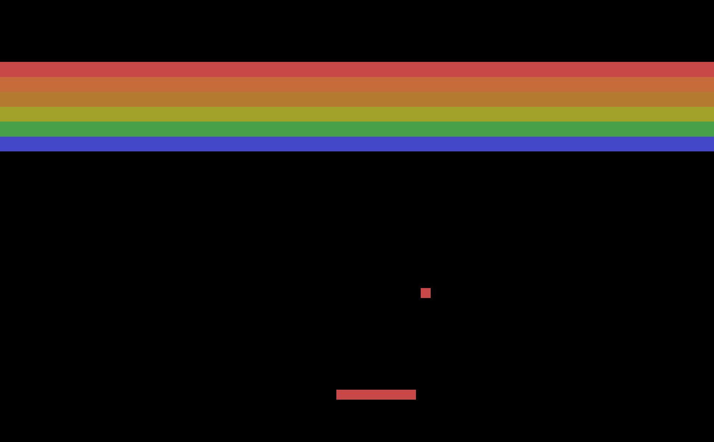

# reinforcement learning with spiking policy networks



An exploration of Spiking Policy Networks.

[Here's](https://www.notion.so/camilonotes/Spiking-neural-networks-in-reinforcement-learning-b6824ef8ce394d749ef5193c4503c3fd) 
a quick summary of what SNNs are, where they come from, and what they can do.

And [here](https://www.notion.so/camilonotes/06-22-2021-Update-e2d08e9f8f714f44be27a2961bd44cf5) are my latest results 
with the project.

## description

In `/breakout` is the spiking policy net solution to BreakoutDeterministic-v4 that I'm iteratively working on (`sqn.py`). 

You'll also find a baseline CNN DQN solution to the env (`dqn.py`), a linear DQN solution, some BindsNet example code (`breakout.py`),
and some rudimentary analysis tools (`analysis.py`).

## installation

If you're on Big Sur, you'll need to be running Python3.9.

Install python dependencies,

```bash
pip3 install -r requirements.txt
```

gym dependencies,

```bash
brew install ffmpeg
brew install llvm
brew install boost
brew install hdf5
```

install and configure [mujoco-py](https://github.com/openai/mujoco-py),


and update your .bashrc/.zshrc.

```bash
# Add this to your .bashrc/.zshrc:
export PATH="/usr/local/opt/llvm/bin:$PATH"

export CC="/usr/local/opt/llvm/bin/clang"
export CXX="/usr/local/opt/llvm/bin/clang++"
export CXX11="/usr/local/opt/llvm/bin/clang++"
export CXX14="/usr/local/opt/llvm/bin/clang++"
export CXX17="/usr/local/opt/llvm/bin/clang++"
export CXX1X="/usr/local/opt/llvm/bin/clang++"

export LDFLAGS="-L/usr/local/opt/llvm/lib"
export CPPFLAGS="-I/usr/local/opt/llvm/include"
```

